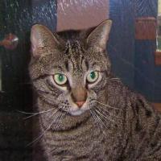

# ScratchML

Bite-sized machine learning models built from the ground up using Python, Numpy, and TensorFlow - with practical examples to solidfy the theory behind the models. Use these Jupyter notebooks as learning resources to discover the inner workings of essential predictive algorithms.     

## Installation
`$ git clone https://github.com/jissac/ScratchML`     
`cd ScratchML`   

## Logistic Regression 
We'll first build a logistic regression model from scratch and use that in a binary classification problem - predicting if an image contains a cat or a dog **(CatsvsDogs_Logistic_Regression.ipynb)**. https://medium.com/@melodious/understanding-deep-neural-networks-from-first-principles-logistic-regression-bd2f01c9e263    

## CNN      
We'll then extend the binary classification example to convolutional neural nets **(CatsvsDogs_LeNet5CNN.ipynb)**. https://medium.com/@melodious/giving-sight-to-the-blind-understanding-convolutional-neural-nets-59dd2bf462ea     

## Datasets
Datasets used in this repository.
### Cats vs. Dogs

           

**Instructions**: After following the installation steps above, download the train1.zip file from https://www.kaggle.com/c/dogs-vs-cats/data. The notebook will provide further instructions on how to divide the files into the training and test folders.

 
